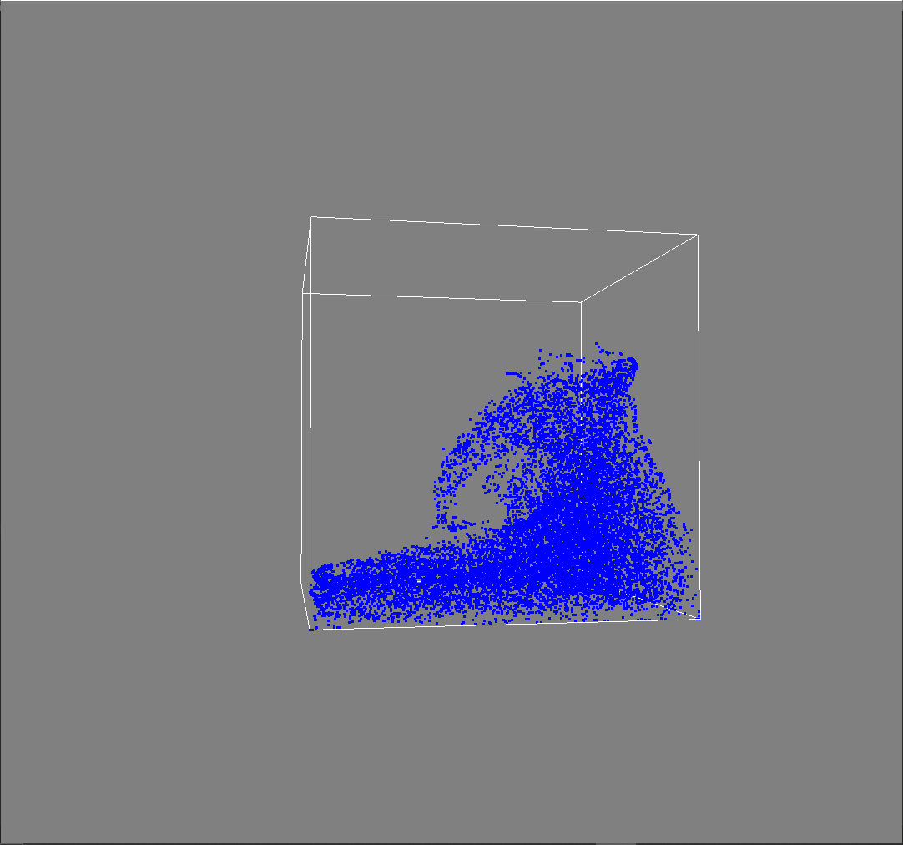

Particle In Cell methods fluid simulation c++.

This is a fluid sim program with the following particle in cell methods implemented:
basic PIC
FLIP-PIC
APIC

Compatible with Ubuntu/WSLUbuntu.

Requirements:
-Bazel
-SDL2
-c++17
-glfw
-eigen3

Build system used is BAZEL.

Installation:

sudo apt-get install bazel-2.2.0 libglfw3-dev libsdl2-dev libeigen3-dev

To build:

cd APIC_FLUID_SIM/pic-core
bazel build //:pic_core

To run:

cd APIC_FLUID_SIM/point-viewer
bazel run //:pv

Enjoy!